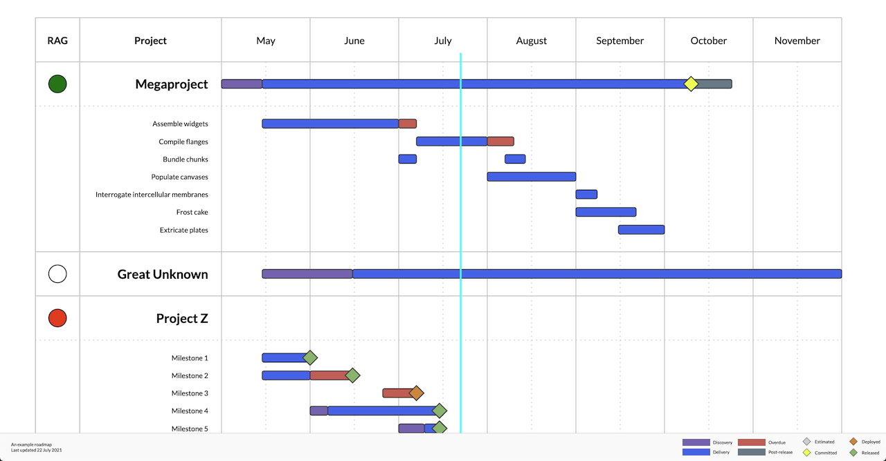

# highweigh

A lightweight roadmap generator.

You want to be able to maintain a roadmap, but Jira is too low level and all the Gantt charts out there are both
too over-complex to set up and not powerful enough to show the things you need to show.

Look, you're a technical person, you're not afraid of a bit of JSON from time to time, and for the love all things
good you'd just like a simple, static HTML page that shows your roadmap. Something that everyone can access in your
organisation without having to buy and configure yet another SaaS product.

Highweigh has got your back.



## How to use it

Check out the sample `data.json`, and replace it with your projects and timelines.  Publish the contents of this
repository to whatever static web server you have handy.  Get back to doing other stuff.

If you're feeling really fancy, make a script to generate the JSON from whatever source you're using to store this
information. But honestly you might find it easier just to update it by hand.

## JSON format

Top level
```
  {
    "title": "An example roadmap",  // what's this roadmap all about then?
    "lastUpdated": "22 July 2021",  // when did you last update it? any string is fine.
    "startMonth": "2021-05",        // what's the first month to display?
    "months": 7,                    // how many months would you like to show?
    "projects": [
                                    // see Project/Epic below
    ]
  }
```

Project/Epic
```
  {
    "name": "Megaproject",  // the name of your project or epic
    "rag": "green",         // "green", "amber", "red", "none" or not specified - only used for projects
    "description": "Yay!",  // the project description, optional
    "bars": [
                            // see Bar below
    ],
    "milestones": {
      // keys are dates, values are "estimated", "committed", "deployed" or "released"
      "2021-10-10": "committed"
    },
    "epics": [
                            // epics are just like projects without a rag
    ]
  }
```

Bar
```
  {
    "start": "2021-05-01",  // the date that this work starts in YYYY-MM-DD format
    "stop": "2021-05-15",   // the date it stops, that's one day after it ends
    "type": "discovery"     // "discovery", "delivery", "overdue" or "post-release"
  }
```

## I have a question

### Can I see this on my local computer without having to deploy it?

If you've got python installed, you can start up a simple static webserver that serves whatever's in the current
directory:

```
  python -m SimpleHTTPServer
```

### How do I make a printable/image version?

If you're on a Mac, just print it and use the "Open PDF in Preview" option after selecting landscape and turning
off headers.  Edit/Copy menu item in Preview and you've got an image on your clipboard.

### What's a RAG?

It stands for Red, Amber, Green.  Green means your project is on track to hit its final
delivery date.  Amber, the date is uncertain but with changes you'll be able to make it.  Red, you're not going to
make it.

## Contributing

Go for it.  Pull requests welcome.  Keep in mind it's a simple app and we're keen to keep it simple.

## Copyright and licence

MIT licensed.  Copyright 2021 Raygun Limited.
